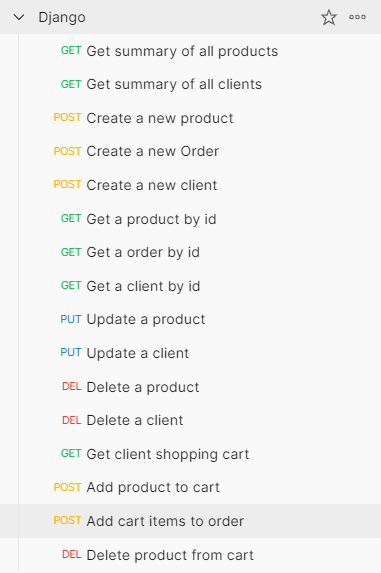

# Assignment

Oh, hello!
---------
First of all, awesome that you want to join our team! We already know that you're a cool person, but now we just want to know if you're a cool coder as well! To that end we've set up a basic exercise for you to complete.

**Our tech stack!**

Before we start off, let me elaborate about our tech stack. For most projects, we use the following technologies:

* Python, for rapid development
* Relational database, we mostly use PostgreSQL 
* Widely accepted frameworks, we mostly use the Django Framework
* Database ORM, because using a standard is faster and more secure (default provided by Django)

The assignment
---------
A company specialised in car parts wants to modernise their company, and start selling their parts online. Being the pro car salesmen that they are, they decided to develop the front-end via another agency. They entrust the back-end to none other than Label A.

After some initial research, we've defined the following user stories on top of our backlog:

* As a company, I want all my products in a database, so I can offer them via our new platform to customers
* As a client, I want to add a product to my shopping cart, so I can order it at a later stage
* As a client, I want to remove a product from my shopping cart, so I can tailor the order to what I actually need
* As a client, I want to order the current contents in my shopping cart, so I can receive the products I need to repair my car
* As a client, I want to select a delivery date and time, so I will be there to receive the order
* As a client, I want to see an overview of all the products, so I can choose which product I want
* As a client, I want to view the details of a product, so I can see if the product satisfies my needs

Develop an API according to the user stories defined above. You should not spend more than 8 hours on this exercise, so put on your MVP glasses and prioritise according to what you think the product should minimally entail.

Included in this repository:

* A freshly installed Django Framework (with not admin user -> go to this page to see how to create one: https://docs.djangoproject.com/en/1.8/intro/tutorial02/)
* For convenience you can use .sqllite which is already configured in the project instead of PostgreSQL
* Bonus points if you can include PostgreSQL in a Docker setup -> base Dockerfile is included

We can make the following assumptions:

* We don't have to worry about the front-end, but should think of a data format a JavaScript application can handle
* We don't need to worry about the payment of the order. Who needs money anyway?

How to score bonus points (ergo: we really advise you to tackle it this way):

* Implement a RESTful API
* Use a ORM
* Document how we can set up and instantiate the project, so we can easily test it functionally

If you have any questions, feel free to contact us! Any feedback on this exercise is always welcome!


**Want to run the project in Docker?**

- ```docker build -t autocompany .```
- ``` docker run -p 80:80 -d autocompany```
- Navigate to ```http://127.0.0.1/```

**Want to setup dev environemnt in Docker? with State Reloader**

- ```docker-compose -f docker/docker-compose.yml build```
- ```docker-compose -f docker/docker-compose.yml up -d```
- Navigate to ```http://localhost:6600/```
- Postman collection included
- 

**Want to unit test in Docker?**
- ```docker build -f docker/unit_test/Dockerfile -t autocompany-api .```
- ```docker run --rm -v $PWD:/app -it autocompany-api```